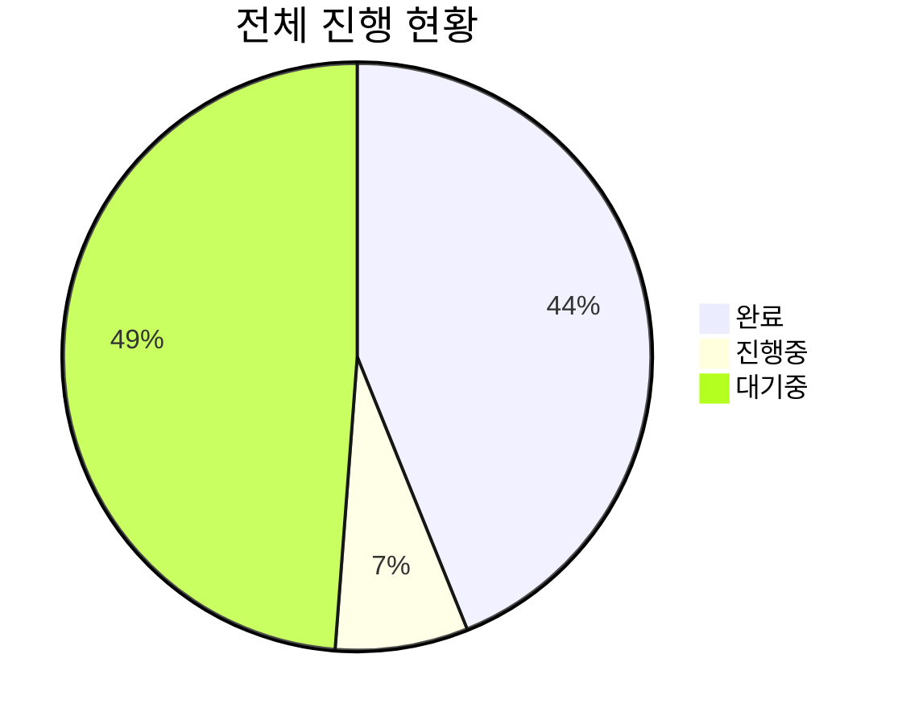

## 📌 기본 정보

**프로젝트명**: KGAMeta8th_ContractProject_DM  
**보고서 작성일**: 2025-02-21  
**보고 기간**: 2025-02-21 ~ 진행중

## 📋 태스크 상세 내역

<h3>🔧 기능 개발</h3>

| 태스크 ID                                                                            | 태스크명              | 담당자                                                                                                                                                                                                                                                                                                                                                                     | 예상 시간 | 실제 시간 | 진행 상태         | 우선순위 |
| ------------------------------------------------------------------------------------ | --------------------- | -------------------------------------------------------------------------------------------------------------------------------------------------------------------------------------------------------------------------------------------------------------------------------------------------------------------------------------------------------------------------- | --------- | --------- | ----------------- | -------- |
| [TSK-20](https://github.com/KGAMeta8thTeam1/KGAMeta8th_ContractProject_DM/issues/20) | 기본 노트 판정 시스템 | [김진](https://github.com/KGAMeta8thTeam1/KGAMeta8th_ContractProject_DM/tree/Dev_JKim), [김현지](https://github.com/KGAMeta8thTeam1/KGAMeta8th_ContractProject_DM/tree/Dev_HJKim), [류지형](https://github.com/KGAMeta8thTeam1/KGAMeta8th_ContractProject_DM/tree/Dev_JHRYU), [김범희 ](https://github.com/KGAMeta8thTeam1/KGAMeta8th_ContractProject_DM/tree/Dev_KimBeom) | 17d       | -         | 🟡 진행중 (80.0%) | -        |
| [TSK-21](https://github.com/KGAMeta8thTeam1/KGAMeta8th_ContractProject_DM/issues/21) | 콤보 시스템           | [김진](https://github.com/KGAMeta8thTeam1/KGAMeta8th_ContractProject_DM/tree/Dev_JKim), [김현지](https://github.com/KGAMeta8thTeam1/KGAMeta8th_ContractProject_DM/tree/Dev_HJKim), [류지형](https://github.com/KGAMeta8thTeam1/KGAMeta8th_ContractProject_DM/tree/Dev_JHRYU), [김범희 ](https://github.com/KGAMeta8thTeam1/KGAMeta8th_ContractProject_DM/tree/Dev_KimBeom) | 17d       | -         | 🟡 진행중 (0.0%)  | -        |
| [TSK-19](https://github.com/KGAMeta8thTeam1/KGAMeta8th_ContractProject_DM/issues/19) | 점수 관리 시스템      | [김진](https://github.com/KGAMeta8thTeam1/KGAMeta8th_ContractProject_DM/tree/Dev_JKim), [김현지](https://github.com/KGAMeta8thTeam1/KGAMeta8th_ContractProject_DM/tree/Dev_HJKim), [류지형](https://github.com/KGAMeta8thTeam1/KGAMeta8th_ContractProject_DM/tree/Dev_JHRYU), [김범희 ](https://github.com/KGAMeta8thTeam1/KGAMeta8th_ContractProject_DM/tree/Dev_KimBeom) | 17d       | -         | 🟡 진행중 (0.0%)  | -        |
| [TSK-22](https://github.com/KGAMeta8thTeam1/KGAMeta8th_ContractProject_DM/issues/22) | NoteEditorSystem      | [최현성](https://github.com/KGAMeta8thTeam1/KGAMeta8th_ContractProject_DM/tree/Dev_HSChoi)                                                                                                                                                                                                                                                                                 | 38d       | -         | 🟡 진행중 (0.0%)  | -        |
| [TSK-44](https://github.com/KGAMeta8thTeam1/KGAMeta8th_ContractProject_DM/issues/44) | 롱노트 시스템         | [김진](https://github.com/KGAMeta8thTeam1/KGAMeta8th_ContractProject_DM/tree/Dev_JKim), [김현지](https://github.com/KGAMeta8thTeam1/KGAMeta8th_ContractProject_DM/tree/Dev_HJKim), [류지형](https://github.com/KGAMeta8thTeam1/KGAMeta8th_ContractProject_DM/tree/Dev_JHRYU), [김범희 ](https://github.com/KGAMeta8thTeam1/KGAMeta8th_ContractProject_DM/tree/Dev_KimBeom) | 17d       | -         | 🟡 진행중 (0.0%)  | -        |

<h3>🎨 UI/UX</h3>

| 태스크 ID | 태스크명 | 담당자 | 예상 시간 | 실제 시간 | 진행 상태 | 우선순위 |
| --------- | -------- | ------ | --------- | --------- | --------- | -------- |

<h3>🔍 QA/테스트</h3>

| 태스크 ID | 태스크명 | 담당자 | 예상 시간 | 실제 시간 | 진행 상태 | 우선순위 |
| --------- | -------- | ------ | --------- | --------- | --------- | -------- |

<h3>📚 문서화</h3>

| 태스크 ID | 태스크명 | 담당자 | 예상 시간 | 실제 시간 | 진행 상태 | 우선순위 |
| --------- | -------- | ------ | --------- | --------- | --------- | -------- |

<h3>🛠️ 유지보수</h3>

| 태스크 ID | 태스크명 | 담당자 | 예상 시간 | 실제 시간 | 진행 상태 | 우선순위 |
| --------- | -------- | ------ | --------- | --------- | --------- | -------- |

## 📊 진행 현황 요약

### 전체 진행률

전체 진행 상태: 18/41 완료 (43.9%)

### 📊 카테고리별 진행 현황

| 태스크명               | 완료 | 진행중 | 대기중 | 진행률 |
| ---------------------- | ---- | ------ | ------ | ------ |
| 프로젝트 자동화 시스템 | 8    | 2      | 0      | 80.0%  |
| 기본 노트 판정 시스템  | 10   | 1      | 0      | 90.9%  |
| NoteEditorSystem       | 0    | 0      | 6      | 0.0%   |
| 콤보 시스템            | 0    | 0      | 4      | 0.0%   |
| 점수 관리 시스템       | 0    | 0      | 4      | 0.0%   |
| 롱노트 시스템          | 0    | 0      | 6      | 0.0%   |

### 📅 일자별 상세 현황

| 날짜       | 완료된 태스크 | 신규 태스크 | 진행중 태스크 |
| ---------- | ------------- | ----------- | ------------- |
| 2025-02-25 | 18            | 41          | 3             |

## 📅 태스크 완료 히스토리

<h3 style="display: inline;">📆 2025-02-25 (1개)</h3>

| 투두 ID | 투두명                                                               | 상위 태스크            | 담당자          |
| ------- | -------------------------------------------------------------------- | ---------------------- | --------------- |
| #326    | [프로젝트 자동화 시스템] 태스크 상태 변경 시 자동 업데이트 기능 구현 | 프로젝트 자동화 시스템 | 최현성(@Anxi77) |

<h3 style="display: inline;">📆 2025-02-24 (13개)</h3>

| 투두 ID | 투두명                                                                                                | 상위 태스크            | 담당자              |
| ------- | ----------------------------------------------------------------------------------------------------- | ---------------------- | ------------------- |
| #415    | [프로젝트 자동화 시스템] 머지커밋의 중복검사 로직 개선                                                | 프로젝트 자동화 시스템 | 최현성(@Anxi77)     |
| #402    | [프로젝트 자동화 시스템] 프로젝트 진행보고서 DSR 이슈가 아닌 실질적인 github project 에서 트래킹 구현 | 프로젝트 자동화 시스템 | 최현성(@Anxi77)     |
| #332    | [프로젝트 자동화 시스템] 태스크 히스토리 추적 기능 구현                                               | 프로젝트 자동화 시스템 | 최현성(@Anxi77)     |
| #404    | [프로젝트 자동화 시스템] DSR 이슈 TODO 목록 당일 완료된것 업데이트할떄 지워지는 오류 fix              | 프로젝트 자동화 시스템 | 최현성(@Anxi77)     |
| #403    | [프로젝트 자동화 시스템] DSR 이슈 브랜치별 트래킹 기능 구현                                           | 프로젝트 자동화 시스템 | 최현성(@Anxi77)     |
| #50     | [기본 노트 판정 시스템] 양면 타격 판정 로직 구현                                                      | 기본 노트 판정 시스템  | 김진(@Jine99)       |
| #46     | [기본 노트 판정 시스템] 색상 매칭 검사 로직 구현                                                      | 기본 노트 판정 시스템  | 김진(@Jine99)       |
| #399    | [기본 노트 판정 시스템] 타입별 노트 방향 받기                                                         | 기본 노트 판정 시스템  | 김진(@Jine99)       |
| #48     | [기본 노트 판정 시스템] 타격 정확도 계산 시스템 구현                                                  | 기본 노트 판정 시스템  | 김진(@Jine99)       |
| #67     | [기본 노트 판정 시스템] deltatime 기반 노트 이동 시스템 구현                                          | 기본 노트 판정 시스템  | 류지형(@Rjcode7387) |
| #49     | [기본 노트 판정 시스템] 메이스 회전각 기반 타격 방향 계산 시스템                                      | 기본 노트 판정 시스템  | 김진(@Jine99)       |
| #47     | [기본 노트 판정 시스템] 타격 방향 벡터 계산 및 판정 로직 구현                                         | 기본 노트 판정 시스템  | 김진(@Jine99)       |
| #45     | [기본 노트 판정 시스템] 노트와의 충돌 감지 시스템 구현                                                | 기본 노트 판정 시스템  | 김진(@Jine99)       |

<h3 style="display: inline;">📆 2025-02-23 (2개)</h3>

| 투두 ID | 투두명                                                        | 상위 태스크            | 담당자          |
| ------- | ------------------------------------------------------------- | ---------------------- | --------------- |
| #392    | [프로젝트 자동화 시스템] 태스크 진행률 계산 및 표시 로직 개선 | 프로젝트 자동화 시스템 | 최현성(@Anxi77) |
| #393    | [프로젝트 자동화 시스템] 태스크 진행상황 업데이트 로직 구현   | 프로젝트 자동화 시스템 | 최현성(@Anxi77) |

<h3 style="display: inline;">📆 2025-02-22 (2개)</h3>

| 투두 ID | 투두명                                                     | 상위 태스크           | 담당자              |
| ------- | ---------------------------------------------------------- | --------------------- | ------------------- |
| #66     | [기본 노트 판정 시스템] 가로, 세로 그리드를 통한 레인 구현 | 기본 노트 판정 시스템 | 류지형(@Rjcode7387) |
| #65     | [기본 노트 판정 시스템] 노트 생성 및 그리드 구현           | 기본 노트 판정 시스템 | 류지형(@Rjcode7387) |

## 📝 특이사항 및 리스크

| 구분 | 내용 | 대응 방안 |
| ---- | ---- | --------- |
| -    | -    | -         |

---

> 이 보고서는 자동으로 생성되었으며, 담당자가 지속적으로 업데이트할 예정입니다.
